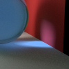

# ATML Practical: Ray Tracer as a Galton Board
When trying to reproduce realistic physical properties of materials
in a ray tracer, the problem can be
phrased as a Monte Carlo sampling problem.
From that perspective, a ray tracer is just a more complex
Galton Board.
We hope to use to adapt the approach in [1] to learn a surogate
ray tracer.

## Generating dataset from ray tracer
To do this, we need to track the path of each ray.
Intermediate 'Z' states are the ray positions and colors at (at each point they bounce).
For now, we can vary properties of diffuse and refractive materials (this is what theta will encode).

Ray tracing works by presupposing that the rays hit the camera, and traces them backwards to a certain depth.
For our purposes, we need to collect the probability that a ray emitted from the light source reaches the point on the camera with a certain colour.
Treating each ray as independent, we can calculate this by considering the probability that the ray bounces the way it does (for each bounce) - the 'transition probability'.
The colour the ray will have at that step is just a deterministic function of theta and details of the way the ray is bouncing.

This means that comparing theta that differ even slightly in material colors will likely result in one value appearing completely impossible.
In general, we can expect that the parameter space will not be particularly amenable to the RASCAL/SCANDAL forms since they rely on local changes not affecting the joint scores/ratios much.

## Reproducing ML models and adaptation for ray tracing
Todo `@Hina`.

## Exploring learnable scenes and parameters
### Choice of materials
`refractive` and `diffuse` materials seem to be good choices.
 * Rays incident on `refractive` material break into a transmitted and reflected
   component; this can be simulated with a Bernouilli distribution 
 * Rays incident on `diffuse` materials reflect light _in all directions_, according
   to Lambert's cosine law; this can be simulated with samples from a probability density
   function.

### First results
This is a simple setup with a refractive blue glass ball and diffuse walls
(100x100 image with 1000 samples per pixel and 4 max diffusion ray depth).
We can see that interesting shades appear, although it is surprising how uniform
the refractive glass looks.

Adding more lights might make things more interesting.
I will continue to work on different combinations and will aim to have a few options
to choose from, with varying complexity.

### Choice of free parameter
Todo.

## Bibliography
[1] Johann Brehmer, Gilles Louppe, Juan Pavez, and Kyle Cranmer. Mining gold from implicit models to improve likelihood-free inference. PNAS, 2020. [[1805.12244](https://arxiv.org/abs/1805.12244)]
