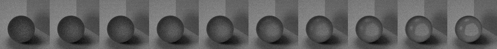

# Coating Light Rays in Gold
Accelerating Ray Tracing with Bayesian Inference

This repository contains the source code used for the reproducibility challenge
of the _Advanced Topics in Machine Learning_ lecture, University of Oxford, Hilary Term 2021.

## Summary
Ray tracing (also known as Monte Carlo Ray Tracing) can be viewed as a physical simulation of light
propagation.
In this project, we have repurposed an existing ray tracer to extract latent variables from each simulated ray,
in order to train a surrogate model for the ray tracer.
We generate datasets containing light rays for different values of a parameter of the rendered scene
(we use properties of the rendered material such as its refractive index or its purity) to train a model that
generalises to unseen material parameters.
This technique could have significant applications to speed up rendering times of animated sequences by
supersampling animation frames using the surrogate renderer.

The work reproduces the approach in [1] with a completely new dataset that is much more
complex than the ideal Galton board simulation used.
The raytracer was forked from [[rafael-fuente/Python-Raytracer](https://github.com/rafael-fuente/Python-Raytracer)],
with changes to explicitly define and extract latent variables.
The code for the raytracer is available in the subrepository linked in [`raytracer`](https://github.com/lmondada/Python-Raytracer).

## Generating the datasets
The datasets and the code to generate them is available in the [`datasets`](datasets) folder.
Two datasets were used, `first_dataset` and `second_dataset`.
 - [`first_dataset`](datasets/first_dataset) contains rays from 128x128 images of a simple 3D scene showing a transparent sphere. For each image,
 the purity of the sphere material was varied between `0.5` and `0.95`. This dataset _does not_ include
 computations of the joint score, making some of the models described in [1] intractable.
 - [`second_dataset`](datasets/second_dataset) contains rays from 50x50 images of the same 3D scene, with purity of the sphere material fixed at `0.9` with varying refractive index between `0.1 + 0j` and `2.4 + 0j`. This dataset contains
 joint scores and joint likelihood ratios of each ray.

 To each dataset, there is a corresponding [tagged release](https://github.com/lmondada/atml-raytracer/releases)
 version of this repo that can be used to reproduce the results.
 The generated datasets are also attached to each release and can be downloaded.

## First dataset preview
Renders of the 3D scene, as used in the first dataset. Images from left to right correspond to increasing purity
`0.50`, `0.55`, ..., `0.95`.

## Bibliography
[1] Johann Brehmer, Gilles Louppe, Juan Pavez, and Kyle Cranmer. Mining gold from implicit models to improve likelihood-free inference. PNAS, 2020. [[1805.12244](https://arxiv.org/abs/1805.12244)]
